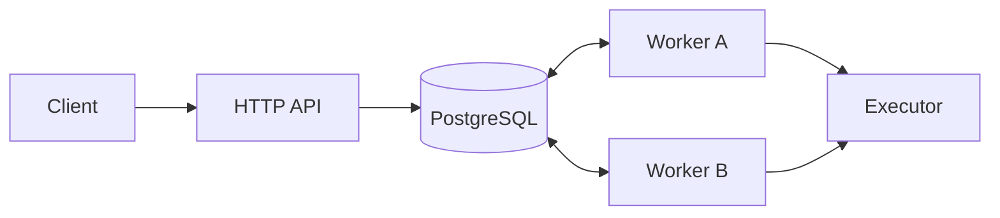

# Architecture

The HTTP API, independent workers, and PostgreSQL form the execution system. PostgreSQL stores jobs, attempts, queue policies, and worker heartbeats. There is no separate broker or scheduler process.

The API validates and commits a job before returning its ID. An optional idempotency key has a unique index and request hash: an identical repeat returns the existing job, while changed input conflicts. The queue is durable as long as PostgreSQL retains committed data.

Workers query queued jobs, due scheduled jobs, and expired running jobs with remaining attempts. Each claim selects one eligible row using `FOR UPDATE SKIP LOCKED`. It checks queue policy limits, increments the attempt count and lease token, and inserts an attempt record in one transaction. The short row lock ends at commit; the lease continues to represent ownership while the task runs. A worker renews its lease during execution. Completion checks job ID, owner, token, and expiry before committing the result.

If an executor returns a retryable error, the worker schedules another attempt using capped exponential backoff and jitter. A nonretryable error ends as `failed`. Retryable work that exhausts its attempt budget becomes `dead_lettered` and can be replayed explicitly. A cancellation request stops cooperative execution; if its worker dies, another worker finalizes cancellation after lease expiry instead of executing the job again.

Queue policies hold shared concurrency limits and token-bucket rate limits. A worker claims one job at a time, but multiple processes can run independently. Worker heartbeats report availability; lease expiry, not a stale heartbeat, decides when work can be reclaimed. Priority aging gives each waiting job one point per minute. An indexed rank lets workers read that order without sorting every eligible row.

The [state machine](state-machine.md) lists legal transitions, [delivery semantics](delivery-semantics.md) defines the at-least-once boundary, [database design](database.md) details the schema and transaction, and [deployment](deployment.md) describes the container stack.
