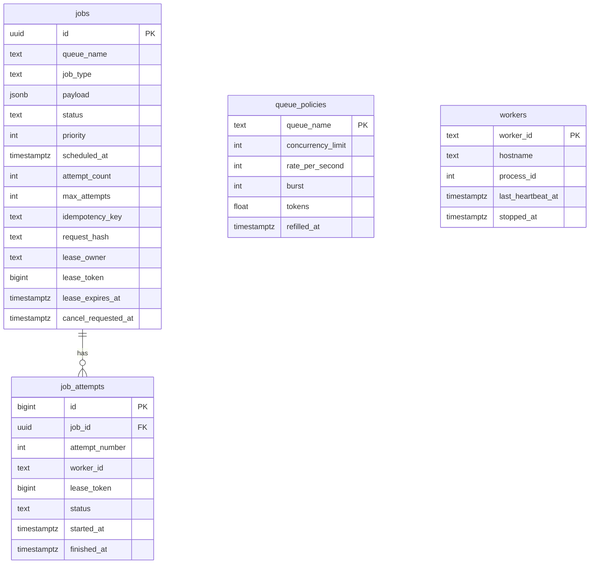

# Database design

PostgreSQL owns job state, scheduling, queue policies, and worker visibility. The API and workers serialize embedded migrations with a transaction-scoped advisory lock. `schema_migrations` records applied versions.

`job_attempts.job_id` has the only declared foreign key in this diagram. Queue names and worker IDs in other tables are logical references: the claim transaction creates a queue-policy row as needed, and a worker record is for observation rather than ownership. Deleting a job cascades to its attempts.

One claim transaction selects an eligible row with `FOR UPDATE SKIP LOCKED`, checks the queue policy, increments `attempt_count` and `lease_token`, records an attempt, and spends a rate token. A failed transaction rolls all of that back. The row lock ends at commit; the owner, token, and expiry guard later renewals and completion. Jobs and attempts are updated together when an attempt finishes.

The unique partial index on nonnull `idempotency_key` prevents duplicate submissions for one key. The claim-rank partial index covers active statuses and orders by continuous priority aging, eligible time, and ID. Other indexes support due scheduled jobs, expired leases, queue-wide active counts, attempt history, and recent-job reads. The rank index uses disk and increases write work on status and lease changes; see [performance](performance.md).
